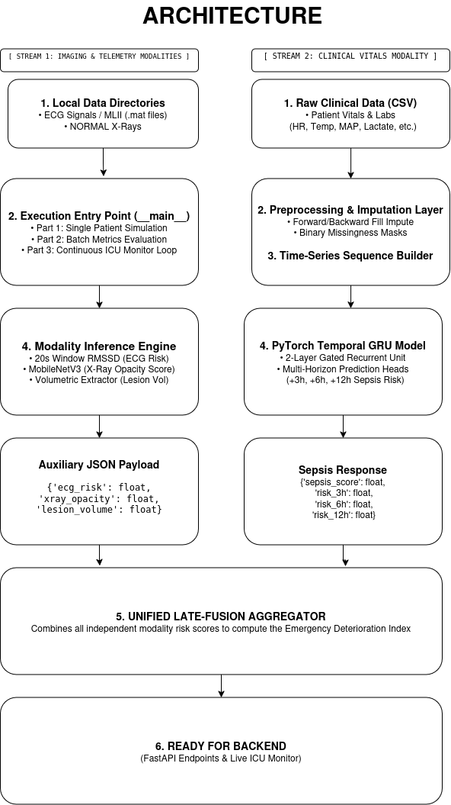

# Team Epoch: CardioPulmo-Sepsis AI

> **CardioPulmo-Sepsis AI** is a real-time multi-modal emergency triage system that fuses 1D ECG telemetry, 2D chest radiographs, and continuous patient vitals. It drives a late-fusion architecture to predict systemic sepsis and organ deterioration cascades hours before clinical failure.

## 📊 Datasets Used
* **Sepsis (Model 1):** [Kaggle Sepsis Prediction Dataset](https://www.kaggle.com/datasets/tea340yashjoshi/sepsis-prediction-dataset?resource=download)
* **ECG / X-Ray (Model 2):** Provided dataset by TAM Club

---

## 🏗️ Master Multi-Modal Pipeline Architecture

